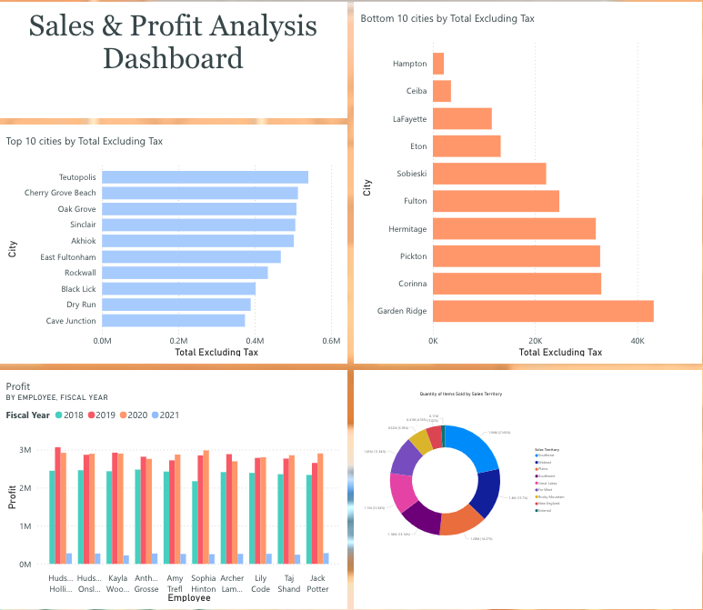
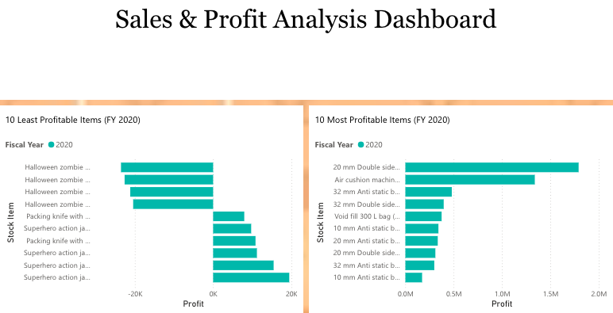

# 🧾 Sales Data Mart — Power BI Dashboard

## 📌 Project Overview
This project was developed as part of a Business Intelligence course.  
The goal was to build a **sales data mart** and create **interactive dashboards** to analyze profit, sales, and product performance across multiple cities, employees, and territories.

The workflow included:
- Extracting and cleaning data
- Building a star schema data model
- Creating calculated fields
- Visualizing insights with Power BI

## Data & Modeling

- 📂 **Raw Data** → `data/sales_data_mart_raw.zip`  
  Original CSV files used for the data mart.

- **Data Model** → `data/sales_data_mart_data_model.xlsx`  
  Cleaned and merged model built with **Excel Power Pivot**, including:
  - Formatted columns (currency, percentages, dates)
  - Calculated columns:
    - `Tax Percent = [Tax Rate]/100`
    - `Sale Total = [Total Excluding Tax] * [Tax Percent] + [Total Excluding Tax]`
  - Star schema relationships
  - Marked Date table for proper filtering

## Dashboard Previews

### Page 1 — Sales & Profit Overview
- Profit by Employee (FY 2018–2020)  
- Top 10 Cities by Total Excluding Tax  
- Bottom 10 Cities by Total Excluding Tax  
- Quantity of Items Sold by Sales Territory  

### Page 2 — Product Profitability (FY 2020)
- 10 Least Profitable Products  
- 10 Most Profitable Products  

## Key Insights
- Identified the **most profitable salesperson** in FY 2020  
- Top city by sales excluding tax  
- Mideast sales territory’s share of total quantity  
- Most and least profitable products for FY 2020  
- Profit trends across employees and years

## Tools Used
- Microsoft Excel (Power Query / Power Pivot)
- Power BI Online
- Star Schema Design
- Basic DAX & Calculated Columns

## 👩🏽 Author
**Georgia Iferi**  
Data Analytics | Business Intelligence | Power BI | Excel | SQL
